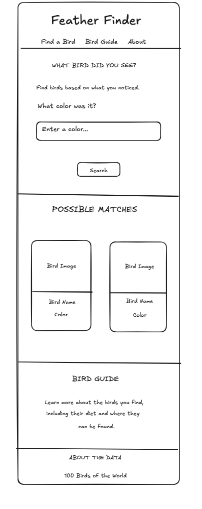

# Feather Finder

## Purpose

The purpose of the Feather Finder is to help people quickly identify birds and learn basic information about them in a simple and easy-to-use way.

## The problem

A beginner bird watcher needs a simple way to identify a bird they see because they may not know the bird's name or species. My page will let them choose a bird's primary color and show matching birds with information to help identify it.

## The plan

## What changed

My page is still pretty close to my original plan. The search works and shows matching birds from my API. I learned that searching by color can also bring back birds with other primary colors because the API searches the whole record. I still want to add bird images and make the results easier to look through.

### Sections

- **Find a Bird** — a visitor can search for a bird using its primary color.
- **Possible Matches** — shows the birds that match the visitor's search.
- **Bird Guide** — shows more information about the birds, including their diet and range.
- **About the Data** — explains the dataset used for Feather Finder.

### User input

- A visitor types a bird's primary color and the page shows birds that match their search.

### Outputs

Each result shows `Name`, `Primary Color`, and `Image of Bird`.

## Data

birds

| Field | Example Value |
| --- | --- |
| id | 1 |
| Name | American Goldfinch |
| Scientific Name | Spinus tristis |
| Conservation Status | Least Concern |
| Primary Color | Yellow |
| Diet | seeds, insects |
| Image of Range | https://upload.wikimedia.org/wikipedia/commons/thumb/7/72/American_Goldfinch-rangemap.png/330px-American_Goldfinch-rangemap.png |
| Image of Bird | https://www.allaboutbirds.org/guide/assets/photo/63737371-480px.jpg |

## Questions

1. Which birds have the same primary color?
2. What do different bird species eat?
3. Where in the world can different birds be found?

## Links

- Live: https://kevinikal.github.io/feather-finder/
- Repo: https://github.com/KevinikaL/feather-finder.git